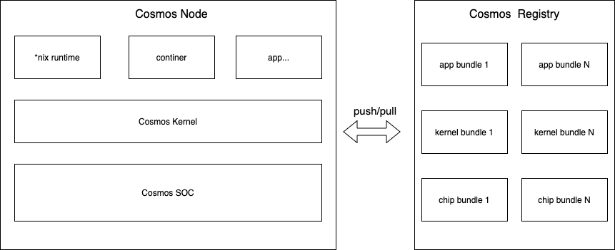
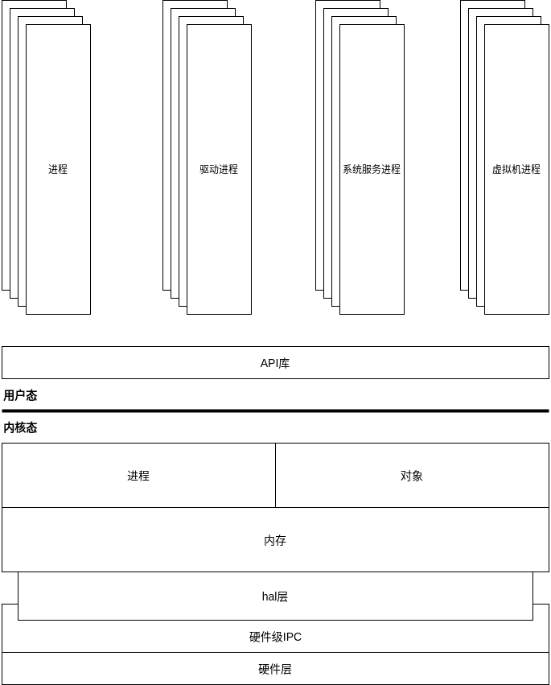
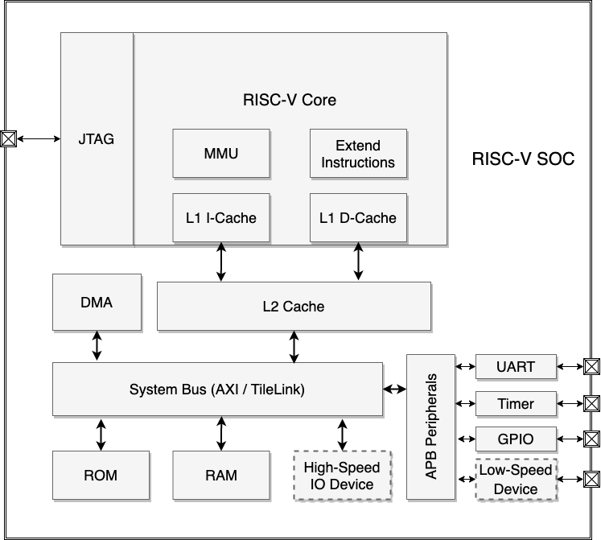

# Cosmos项目简介

## 一、项目简介

Cosmos项目是一个由 **Cosmos开发者团队(详见贡献者)** 自主设计、研发包含了操作系统与RISC-V软核SOC处理器的计算机基础设施。Cosmos项目受到了OSDI'18 LegoOS论文的启发，目标在彻底抛弃目前计算机体系中积累的软硬件体系中的诸多历史包袱后，引入现代化的工程思想进行重新设计与实现。从而使得操作系统、芯片可以具有更高的模块化、低耦合、以及更强的可复用性和可扩展能力。Cosmos项目由Cosmos OS操作系统和Cosmos SOC芯片两部分构成。宏观架构图如下：

## 二、技术

**Cosmos OS：**  https://github.com/CosmosPsi/CosmosOS

​    主要由C语言开发。主要由用户层和内核层两层构成。用户层主要用于运行各种应用，而应用程序则通过API库，请求内核服务。Cosmos的内核层在传统宏内核、微内核、以及LegoOS架构的思想之上创新性的提出了“Ψ(Psi)”架构。基于“Ψ(Psi)”架构的内核层的主要功能是提供操作系统所需的基础服务。

​    Cosmos内核基于面向对象的编程思想进行设计，主要包含了：对象接口、IPC同步/异步通信对象、安全对象、通用对象、内存对象、进程线程对象、对象管理、内存管理等基础模块。不止面向对象，Cosmos内核还应用了现代软件工程中的很多技术手段来保证Cosmos内核在高性能、高内聚、低耦合、高可扩展性等特点上达到最优化。

**Cosmos SOC：**  https://github.com/CosmosPsi/CosmosSOC 

​    Cosmos-SOC使用Chisel 语言进行硬件敏捷开发，基于 RISC-V RV64 开放指令集的处理器实现。存储系统方面，Cosmos-SOC包含一级指令缓存和数据缓存及二级缓存。 处理器通过系统总线（ AXI、TileLink、APB ）与外界相连. Cosmos-SOC支持 M、S、U 三个特权级, 支持 I、M、A、C以及扩展指令, 包含MMU以支持虚实地址转换, 包含页表缓冲 (TLB) 以加速地址转换过程, 支持 Sv39 分页方案。后续还会为Cosmos内核的部分特性定制专有指令集及SOC模块。

## 三、快速上手

- TODO

## 四、联系我们

项目接口人邮箱：546817486@qq.com

项目接口人微信：

## 五、贡献者

@LMOS

@Lnb

@ChenChen

@RXY

@YasonLee

@JDQ

## 六、FAQ

## 七、特别鸣谢

